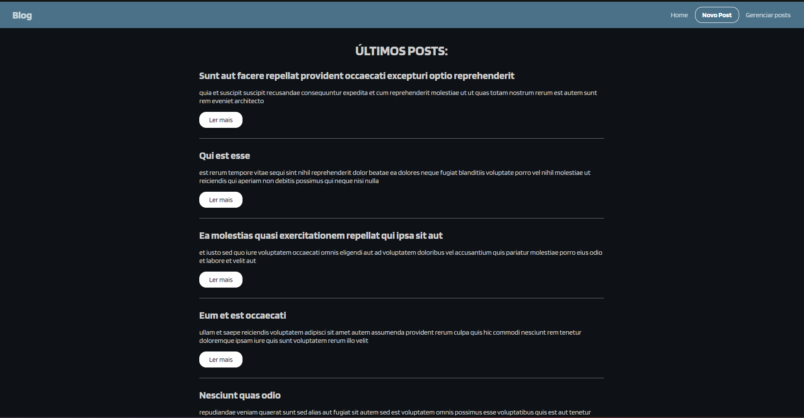
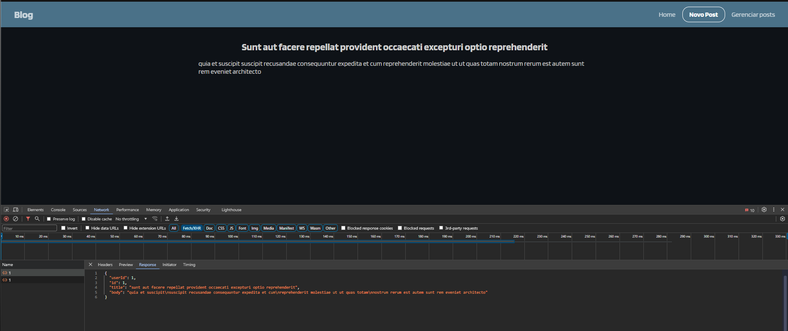
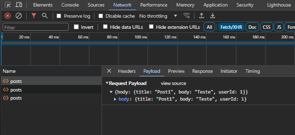
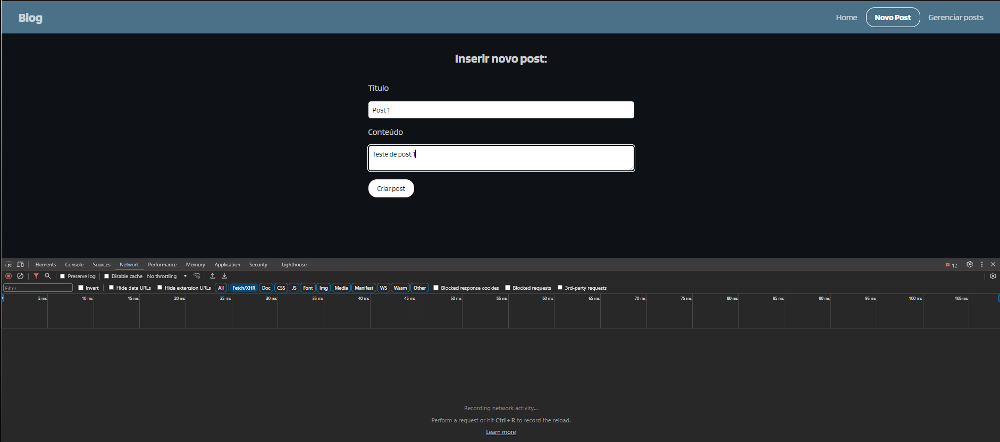
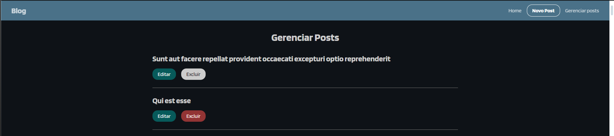
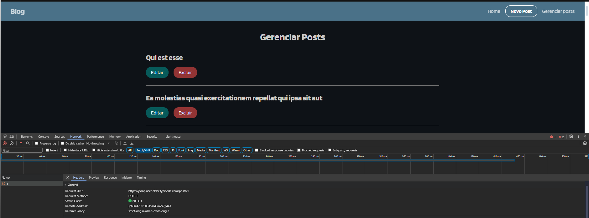
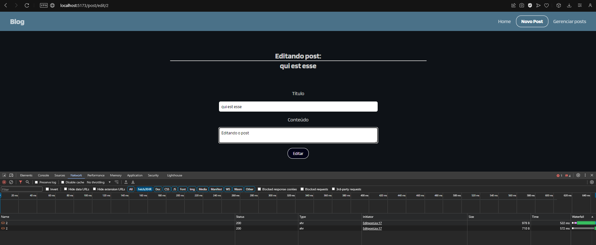
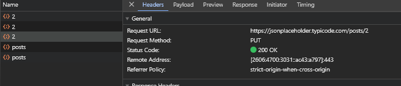
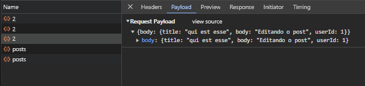

<h1 align="center"> Blog CRUD com Axios</h1>

  

  <a href="#-tecnologias">Techs/Tecnologias</a>&nbsp;&nbsp;&nbsp;|&nbsp;&nbsp;&nbsp;
  <a href="#-projeto">Project/Projeto</a>&nbsp;&nbsp;&nbsp;|&nbsp;&nbsp;&nbsp;
  <a href="#-layout">Layout</a>&nbsp;&nbsp;&nbsp;|&nbsp;&nbsp;&nbsp;
  <a href="#memo-licença">License/Licença</a>

  

  

  

  

  

  

  

  

  

## 🚀 Techs / Tecnologias

Esse projeto foi desenvolvido com as seguintes tecnologias:

- JavaScript
- REACT JS
- NODE JS
- REACT ROUTER DOM
- AXIOS
- JSON PLACE HOLDER
- HTML e CSS
- Git e Github

## 💻 Project / Projeto

Essa aplicação é um blog simples destinado para gerenciar CRUD(get, post, delete, put) utilizando AXIOS como biblioteca REACT, utilizando SPA (Single Page Application). Foi utlizado o site "https://jsonplaceholder.typicode.com", para busca de banco de dados dos posts, onde é disponibilizado diversos recursos para exemplificar. 
Foram criadas 5 rotas: 
    - Home: página inicial.
    - New Post: para criar um novo post.
    - Post: para detalhar o post buscando pelo ID, quando clicado em "Ler mais"
    - Admin: página onde é possivel editar e deletar os posts.
    = Edit post: página destinada a fazer a edição do post, podendo alterar título e descrição.
Todas as páginas possuem a navbar que está como componente acima do Container principal em App.
Também foi criada uma configuração de baseURL para servir de padrão para as requisioes em 'config.jsx'.

This application is a simple blog designed to manage CRUD (get, post, delete, put) using AXIOS as a REACT library, using SPA (Single Page Application). The website "https://jsonplaceholder.typicode.com" was used to search the database of posts, where several resources are available to provide examples.
5 routes were created:
    - Home: home page.
    - New Post: to create a new post.
    - Post: to detail the post by searching for the ID, when clicking on "Read more"
    - Admin: page where you can edit and delete posts.
    = Edit post: page designed to edit the post, being able to change the title and description.
All pages have the navbar which is as a component above the main Container in App.
A baseURL configuration was also created to serve as a default for requests in 'config.jsx'.

## 🔖 Layout

Você pode visualizar o layout do projeto através do repositório e do deploy. 
